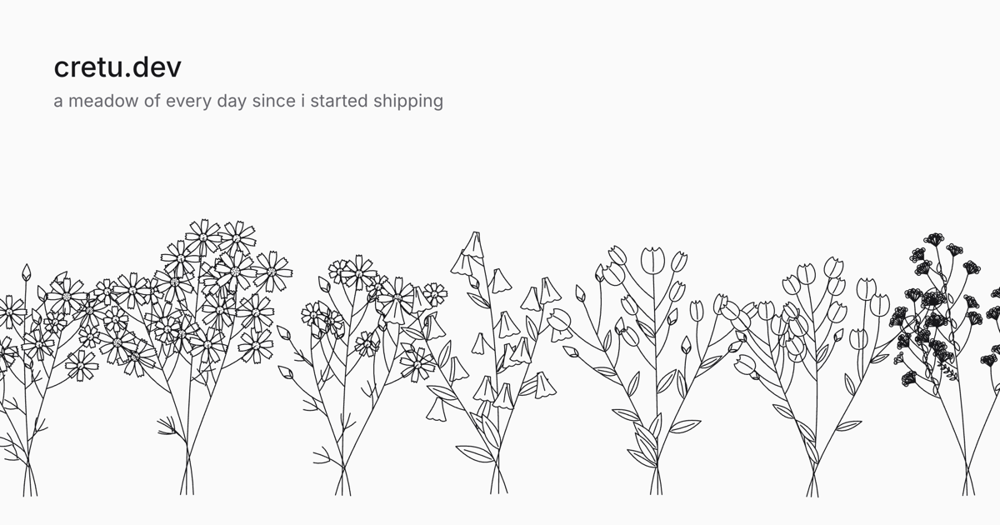

# cretu.dev

my corner of the internet, grown as a meadow.

every day since aug 2021 is a flower or a leaf. busy days bloom, essays are the big ones, and every job is tied on with a little tag. scroll to zoom in, and each month tells you what happened. click a flower to read the essay it grew from.

no images: every flower is drawn in code from that day's data. the sound is synthesised in the browser too.



```
pnpm i && pnpm dev
```

the meadow lives in `src/scripts/days-field.ts` and `src/scripts/variants/`. contributions refresh into `src/data/contributions.json`.

mit. do whatever.
